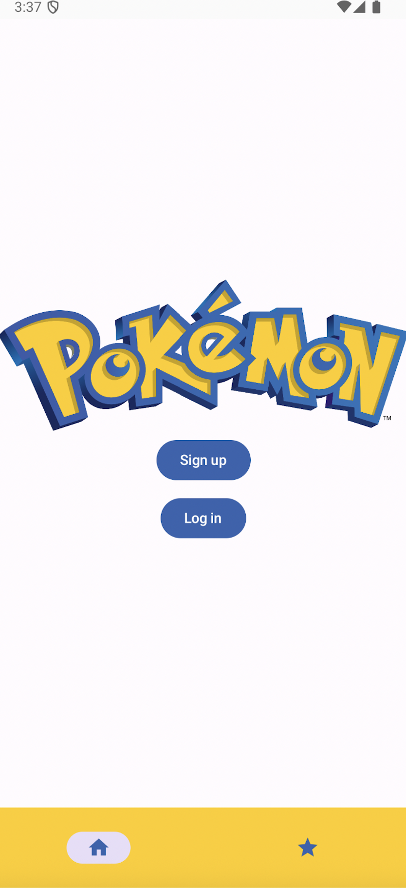
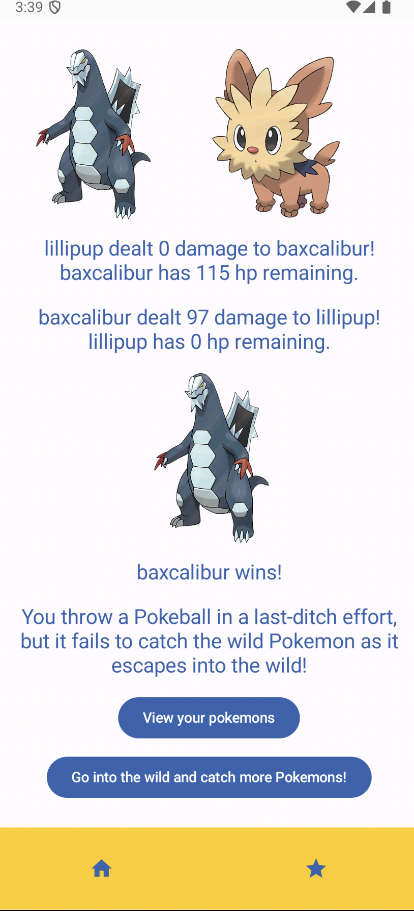

### Pokemon App

An game that lets players create an account, catch pokemons in the pokeworld, and battle pokemons.

When the player creates an account, the password is hashed in Room using BCrypt. 

In the pokeworld, the player encounters a random pokemon (a randomly generated id number is to fetch the random pokemon from the PokeAPI), and can try to catch it. Catch success is 50%, determined by randomly generating a boolean. 

If the catch is unsuccessful, the player may choose a pokemon from their roster to battle the wild pokemon. 

In the battle, the player's pokemon will attack first, followed by the wild pokemon, and this will repeat until one pokemon's current hp drops to 0. If the wild pokemon is victorious, it escapes. If the player's pokemon wins, the player will catch the wild pokemon.

In the player's home page, the player may view their pokemon roster.
